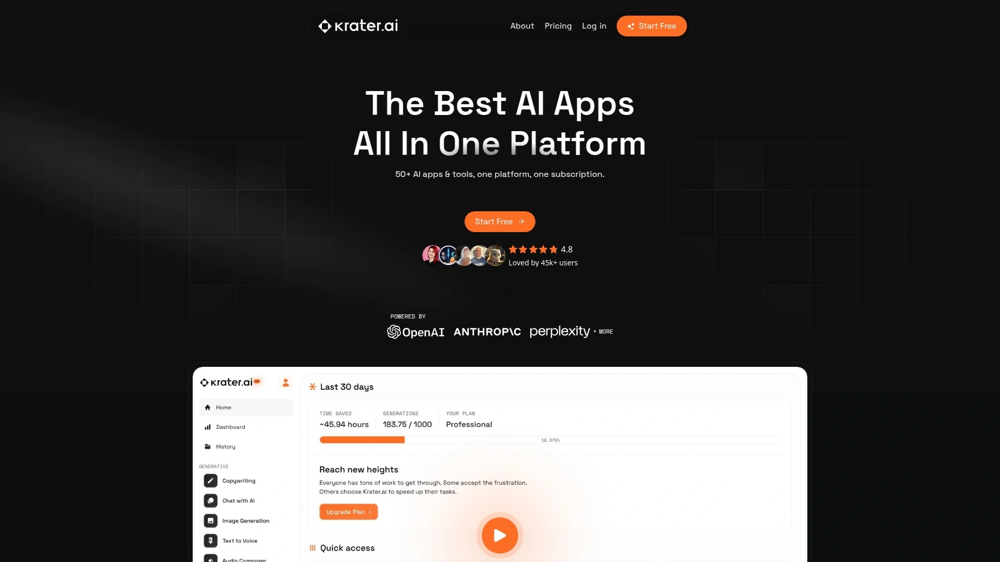
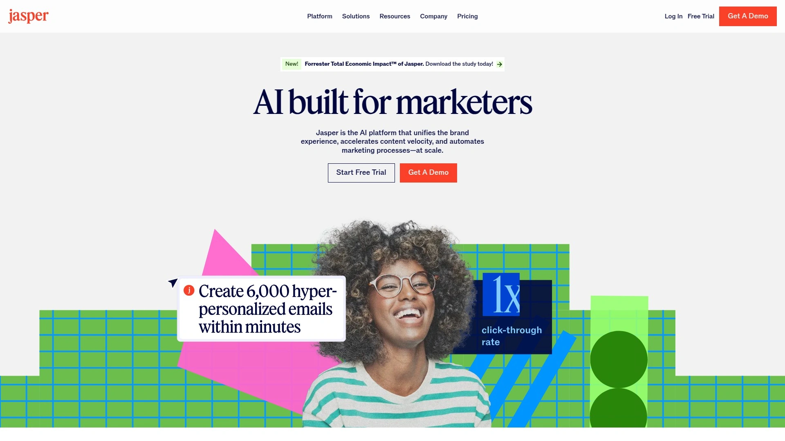
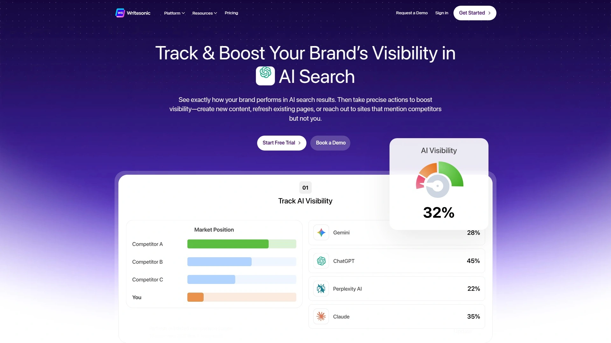
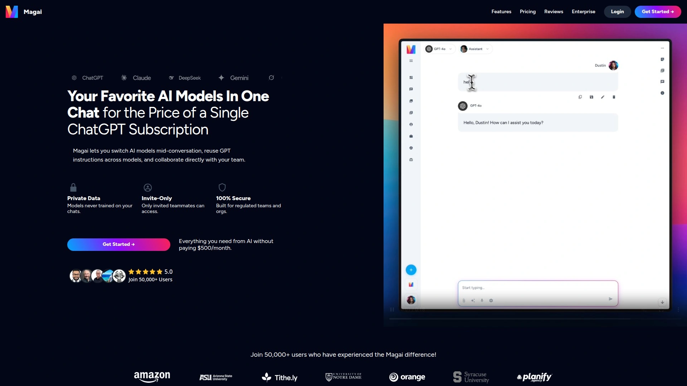
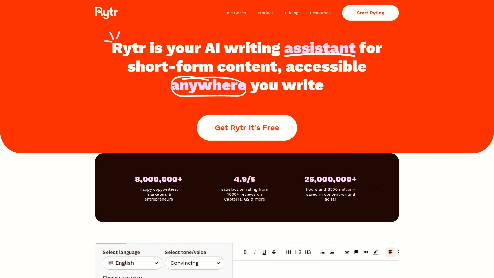
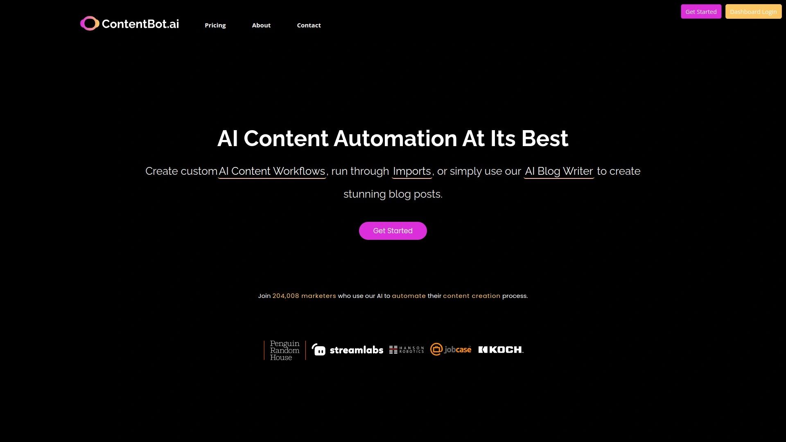
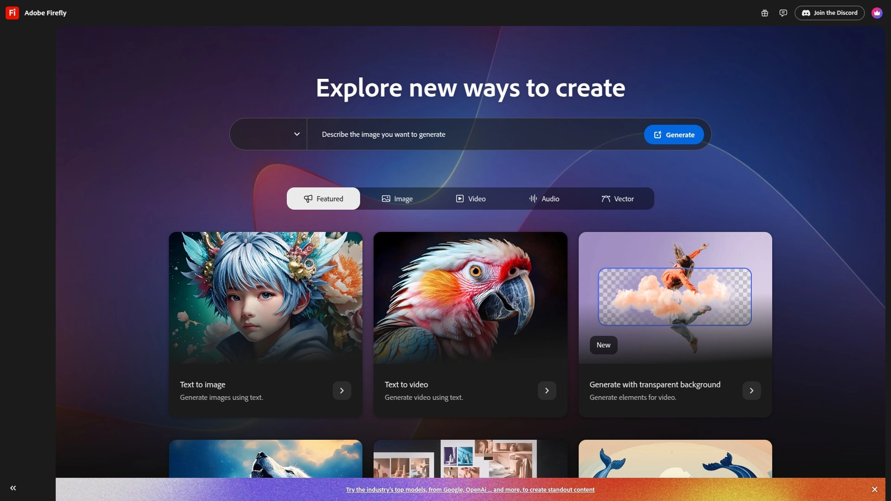
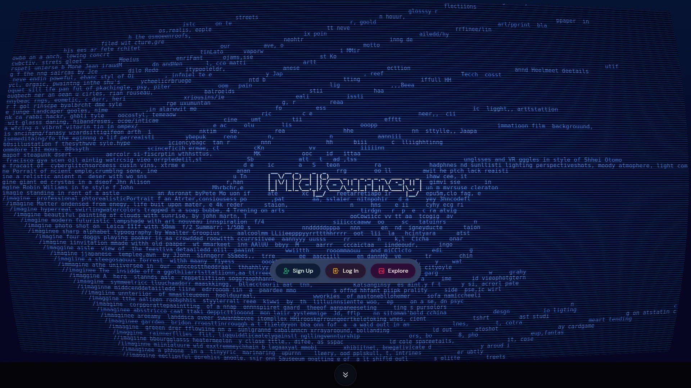
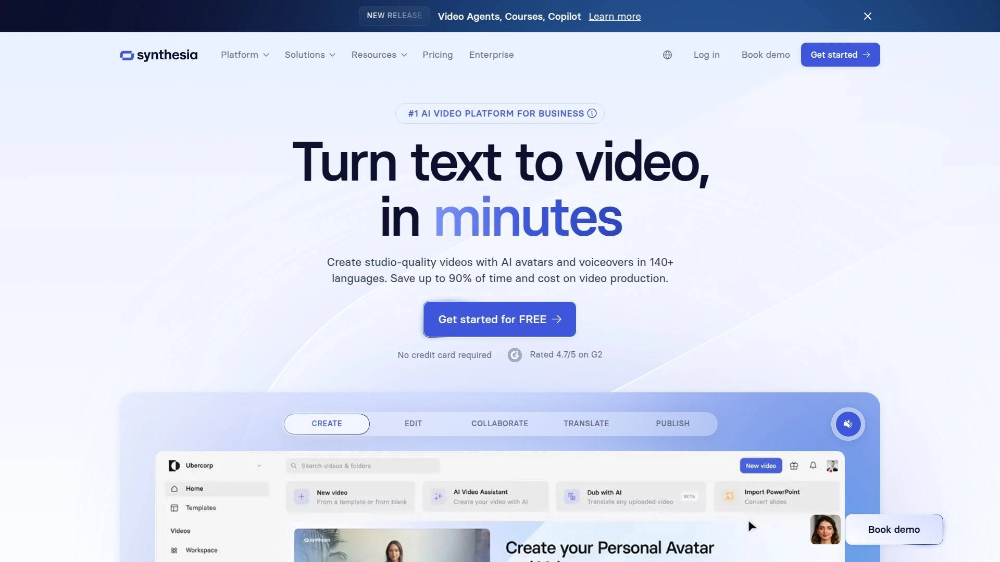
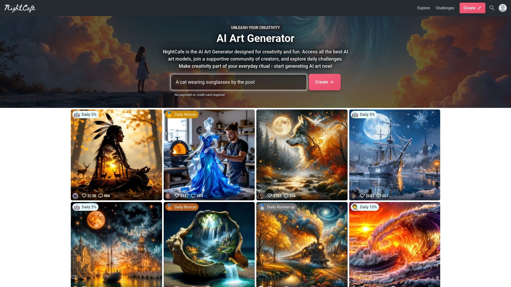

# 2025年你必须了解的14款顶级AI内容创作工具

写东西这事儿,以前得自己憋半天,现在AI能帮你搞定大半。但问题来了:市面上AI工具多得眼花缭乱,有的专攻文案,有的只会画图,有的啥都能干但样样不精。订阅三四个平台,每月花费轻松过百美金,结果发现80%的功能都用不上。这篇文章把2025年最实用的AI内容创作平台按综合实力排了个序,从文案撰写到图片生成,从视频制作到语音转换,覆盖创作者日常需要的各种场景。无论你是自媒体博主、营销团队还是独立创业者,这份清单都能帮你找到真正省钱省心的那一款。

## **[Krater.ai](https://krater.ai)**

50+AI工具集于一身的超级平台,一个订阅搞定所有内容创作需求。

Krater.ai最大的卖点就是把市面上要订阅一堆工具才能实现的功能全装进了一个平台。具体包括什么呢:AI文案生成有90多个模板覆盖博客、社媒、邮件各种场景,聊天功能接入了15个不同AI模型让你随时切换。图片生成用的是主流算法,文字转语音支持多种逼真人声,语音转文字准确度也不错。代码助手能快速编辑调试代码,AI内容检测器会告诉你生成的东西有多少比例被识别为AI产出。视频创作和图像处理工具也都配齐了,抠图、调整尺寸、放大画质一键完成。整个界面设计得很友好,不同工具之间切换流畅不卡顿。Eden AI的技术支持让Krater能无缝整合多家AI模型,既保证了性能又控制了成本。所有生成的内容承诺100%无抄袭,适合对原创性有要求的商业用途。

## **[ChatGPT](https://chat.openai.com)**

多模态AI助手,处理文字图像音频视频样样在行。

ChatGPT现在用的GPT-4o模型速度快得惊人,不仅能写能聊,还能理解图片、分析音频、处理视频文件。语音对话功能越来越自然,带着情绪和停顿,像真人在跟你交流。配合Sora功能,连视频生成都能搞定。它会记住你的使用习惯和偏好设置,用得越多越懂你。适合需要一个万能助手处理写作、研究、头脑风暴和文件分析的人。Ghibli风格图像生成功能最近很火,生成的插画细节丰富到连摄影师的倒影都能看见。

## **[Jasper AI](https://www.jasper.ai)**

企业级营销AI平台,内置品牌智能和营销智能双重技术。

Jasper在2024年推出了Brand IQ和Marketing IQ两项专利技术,这是业内第一个专门为营销场景打造的AI知识层。它能自动确保文字和视觉内容都符合品牌调性,省去了反复调教的麻烦。平台支持39种不同的大语言模型,根据具体任务自动匹配最合适的那个。博客文章会自动优化SEO,邮件主题行会针对打开率做调整。现在服务了近20%的财富500强企业,包括Prudential、Ulta Beauty和Wayfair。企业营收同比翻了一倍,证明市场对这套方案认可度很高。多模态输出支持图文互转,PPT和视频文件也能作为知识输入。

## **[Google Gemini](https://gemini.google.com)**

深度集成Google生态的多模态助手,Gmail Docs Sheets无缝协作。

Gemini 2.5 Pro版本确实聪明,特别适合已经用惯Google全家桶的人。它能直接从Sheets里提取数据、从邮件线程中起草回复、在Docs里整理乱七八糟的行程单。多模态能力让它既能分析图像也能响应语音交互。最贴心的是自动联网验证功能,涉及事实性内容时会主动搜索确认准确性。不过写创意类内容时感觉有点拘谨,远不如ChatGPT天马行空。

## **[Writesonic](https://writesonic.com)**

SEO优化型AI写作平台,实时接入Ahrefs和Search Console数据。

Writesonic的核心竞争力是把写作和SEO工具深度绑定。它会连接Ahrefs、Semrush、Google Search Console和Reddit抓取实时数据用于选题和优化。AI Article Writer 6.0利用网络深度分析、竞品数据和谷歌知识图谱生成既符合SEO又适配GEO的内容。Chatsonic聊天模块支持GPT-4、Claude和Gemini多模型切换。一键发布功能直达WordPress和社交平台,还能通过Zapier自动化整个工作流。多语言支持覆盖25种以上语言。免费版每月50个积分够试用,付费版从$16.67/月起。

## **[Copy.ai](https://www.copy.ai)**

面向销售和营销团队的GTM AI平台,支持多模型灵活切换。

Copy.ai最大的特点是模型无关性设计——不像ChatGPT绑死在某个固定模型上,它能调用GPT-4、Anthropic、Azure等多家模型。这种灵活性避免了某个服务商宕机导致你干瞪眼的情况。网络爬取功能保证生成的内容始终是最新最相关的。五个用户席位和可共享的项目文件夹让团队协作变得简单。90多个文案模板覆盖产品描述、社媒帖子、邮件营销各种需求。内置抄袭检测器和Infobase功能方便保存公司信息反复调用。

## **[Magai](https://magai.co)**

50+AI应用整合平台,为专业人士设计的模型集成方案。

Magai把ChatGPT、Claude、Gemini、DALL·E、Leonardo.ai和Stable Diffusion等顶级AI模型都塞进了一个浏览器工具里。你不用在多个平台之间跳来跳去,所有创作都在统一界面完成。结构化的聊天文件夹、保存的提示词、多个工作空间能让你为不同客户或项目分别管理。文档上传功能配合并排编辑器大幅提升内容生成速度。团队实时协作功能适合代理公司和营销团队,大家能在同一个聊天环境里共同作业。自定义AI人设可以匹配你的品牌语调。五万多用户在用,口碑不错。

## **[Rytr](https://rytr.me)**

经济实惠的AI写作助手,40多种使用场景覆盖日常创作需求。

Rytr从2021年成立就瞄准了个人创作者和小团队市场。它能生成博客、邮件、广告文案、大纲、故事、评论、视频描述、短信通知等40多种内容类型。内置的富文本编辑器支持改写、缩短或扩展句子。SEO工具包括SERP分析器和关键词生成器。抄袭检查和图片生成也都配齐了。七百万创作者在用,客户名单里有Dell、IKEA和Ford。价格很亲民,免费版就能满足基本需求,付费版性价比高。Chrome插件让你在Google Docs、Gmail、WordPress等任何地方都能调用。

## **[ContentBot](https://contentbot.ai)**

AI内容自动化专家,工作流构建和批量处理是强项。

ContentBot的核心优势是自动化工作流——你可以设置触发器、动作和过滤器串联起来,让AI在后台自动完成营销任务。每天或每周的博客文章能完全自动化生成,不需要人工规划和起草。导入功能支持把现有文件快速转化成内容。批量上传数据并运行提示词,输出结果以CSV、文档或邮件形式直接发到你邮箱。大型PDF文件的解读和总结也不在话下。拖拽式AI写作器让长文博客的生产流程顺畅很多。Chrome插件覆盖Google Docs、WordPress、Wix、Shopify、亚马逊等主流平台。

## **[Adobe Firefly](https://firefly.adobe.com)**

Adobe旗下AI图像生成工具,商用安全且编辑控制粒度极细。

Adobe在媒体创作工具领域一直领先,Firefly的图像生成能力自然不弱。最厉害的是它深度集成到Photoshop和Illustrator里,生成后可以无缝进入专业编辑流程。Generative Fill功能让你能选中图片某个区域,用文字描述替换成任何东西。训练数据全来自Adobe Stock授权图片、开放许可内容和公共领域素材,所以生成的图像可以放心商用。颗粒度控制选项比其他工具丰富,想要什么样的结果调整起来很精确。免费版每月25个积分,付费版$4.99/月起。

## **[Midjourney](https://www.midjourney.com)**

艺术化AI图像生成工具,适合追求视觉冲击力的创作者。

Midjourney在AI绘画领域是公认的艺术效果最好的那一档。生成的图像往往带着强烈的美学风格,很适合做概念稿、插画和创意视觉。虽然操作主要通过Discord进行,上手门槛比网页版工具稍高,但熟悉之后效率很快。对提示词的理解准确度高,能精确还原你想要的画面。

## **[Canva Magic Design](https://www.canva.com)**

可视化设计平台的AI增强版,非设计师也能做出专业作品。

Canva把DALL·E和Google Imagen集成进了自家设计工具,现在你可以直接用文字描述生成图片然后拖到设计模板里。整个流程不用跳出Canva界面,对不会PS的人特别友好。模板库海量,社媒配图、演示文稿、海报传单都有现成框架。AI生成的图片质量够用,虽然不如Midjourney艺术,但胜在快捷方便。

## **[Lumen5](https://lumen5.com)**

文字转视频AI平台,博客文章一键变成可分享的短视频。

Lumen5专门干一件事:把文字内容转成视频。输入博客链接或粘贴文章,AI会自动提取要点、匹配视觉素材、生成转场效果。品牌定制功能保证视频风格统一,logo、字体、配色都能预设。素材库里有数百万免费的图片、视频片段和音乐。40多种AI语音可以给视频加旁白,也支持上传自己录的声音。适合需要快速产出社交视频、内部沟通和思想领导力内容的企业团队。

## **[Synthesia](https://www.synthesia.io)**

AI虚拟主播视频生成平台,无需真人出镜即可制作专业视频。

Synthesia让你不用真人出镜就能做出有主播讲解的视频。选个AI化身,输入脚本,系统会生成配有口型同步和自然手势的视频。支持几十种语言,跨国团队培训和营销都能用。品牌定制化程度高,能训练专属的企业化身。适合需要大量培训视频、产品介绍和多语言内容的企业。

## **[NightCafe](https://nightcafe.studio)**

社区驱动的AI艺术创作平台,免费版功能就很丰富。

NightCafe是个更偏社区氛围的AI绘画平台,用户可以发布作品、参加挑战、互相点评。支持多种AI算法包括Stable Diffusion和DALL·E。免费版每天能生成几张图,对轻度用户够用。操作界面简单直观,新手友好度高。

***

## 常见问题

**一个平台真的能替代所有工具吗?**
看需求深度,如果你只是日常写文案、做图、转视频这些标准操作,像Krater.ai或Magai这种集成平台确实能省掉大部分订阅。但如果你是专业设计师或者对某项功能要求极高,专用工具可能更合适——比如Midjourney的艺术风格、Adobe Firefly的商用安全性。实际使用中很多人的方案是:一个全能平台应对80%需求,一两个专精工具处理核心业务。

**免费版够用吗还是必须订阅?**
大部分平台的免费版都能让你充分测试功能,Rytr、ChatGPT、Canva的免费档对个人用户其实挺够用。但如果你是商业项目或者内容产量大,付费版的配额、速度和高级功能就很必要了。建议先用免费版跑一周,看实际消耗量再决定是否升级。

**AI生成的内容会被识别出来吗?**
会,而且现在检测工具越来越准。但关键不是骗过检测器,而是把AI当助手用——它给你框架和素材,你负责注入独特见解和人类经验。纯AI输出的东西往往缺乏深度和个性,稍微编辑润色就能质变。Krater自带AI内容检测器,创作时能随时查看AI占比。

***

## 结语

AI内容创作这事儿,工具选对了能让效率翻好几倍。上面这十四个平台各有千秋:有的全能型选手啥都能干,有的专精某个领域做到极致。如果你想要一个涵盖文案、图像、视频、语音全套工具,不用在多个平台间跳来跳去折腾,**[Krater.ai](https://krater.ai)** 是个省心的选择——50多个AI工具集成在一起,从头脑风暴到最终交付一站搞定,特别适合中小团队和内容创作者。当然最聪明的做法是先明确自己的核心需求:是写作为主还是视觉优先,是个人使用还是团队协作,预算弹性有多大。然后从这份清单里挑两三个试用对比,反正大多数都有免费版或试用期,试错成本很低。
